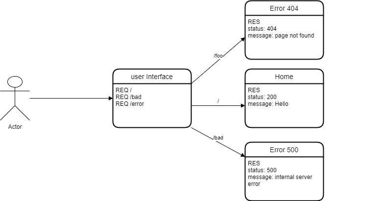

# server-deployment-practice

## URL links for Heroku

[omar-server-deploy-dev](https://omar-server-deploy-dev.herokuapp.com/)
[omar-server-deploy-prod](https://omar-server-deploy-prod.herokuapp.com/)

## Data Flow Diagram

## Download And Start

- Clone the Repository into your local machine
- Get into the repo directory
  `cd server-deployment-practice`

- Install the dependences for tha app
  `npm install`

- Add your dotenv File and add your PORT
  `touch .env`
  `PORT=3000`

- Test the functionality of the app by typing:
  `npm test`

- If the test are passed start the server by typing:
  `npm start`
